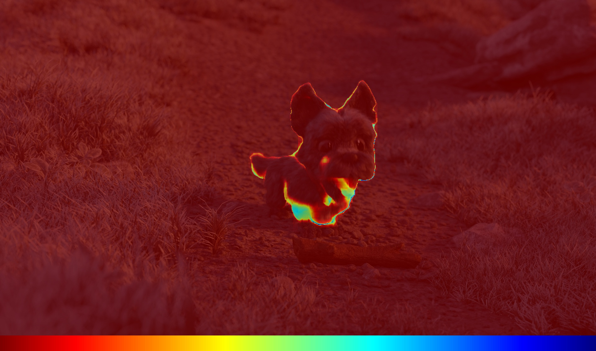

[comment]: <> 

<!-- PROJECT LOGO -->

  <h1 align="center"> SEA-RAFT: Simple, Efficient, Accurate RAFT for Optical Flow
  </h1>

[comment]: <> (  <h2 align="center">PAPER</h2>)
  <h3 align="center">
  <a href="https://kwanwaipang.github.io/Blog_basedon_markdown/SEA-RAFT/">Blog</a> 
  | <a href="https://github.com/princeton-vl/SEA-RAFT">Original Github Page</a>
  </h3>
  

  

 

<!-- ~~~
rm -rf .git
git init
git add .
git commit -m "first commit"
git branch -M main
git remote add origin git@github.com:KwanWaiPang/SEA-RAFT_testing.git
git push -u origin main
~~~ -->

# 创建环境
~~~
conda create --name SEA-RAFT python=3.10.13
conda activate SEA-RAFT
pip install -r requirements.txt
~~~

# 下载模型
[下载google drive文件到服务器](https://kwanwaipang.github.io/File/Blogs/Poster/ubuntu%E5%91%BD%E4%BB%A4%E8%A1%8C%E4%B8%8B%E8%BD%BD%E6%95%B0%E6%8D%AE.html#google-driver)
~~~
conda activate nerf-ngp
gdown https://drive.google.com/uc?id=标识符

# 点击对应文件，share，然后复制粘贴Tartan-C-T-TSKH-spring540x960-M.pth对应的链接如下：
https://drive.google.com/file/d/1a0C5FTdhjM4rKrfXiGhec7eq2YM141lu/view?usp=drive_link

cd models
gdown https://drive.google.com/uc?id=1a0C5FTdhjM4rKrfXiGhec7eq2YM141lu

~~~

# 运行代码
~~~
conda activate SEA-RAFT

pip install huggingface_hub

python custom.py --cfg config/eval/spring-M.json --path models/Tartan-C-T-TSKH-spring540x960-M.pth
~~~

测试效果如下：

  
  
<figcaption>  
输入
</figcaption>

  
  
<figcaption>  
输出结果
</figcaption>

